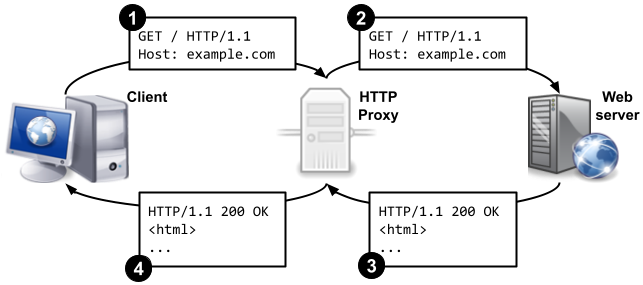

# Programming Project 01: HTTP Proxy

## Overview
In this project, you will implement a HyperText Transfer Protocol (HTTP) proxy that serves as an intermediately between web clients and web servers. When you're done with the assignment, you should be able to configure a web browser to use your HTTP proxy.

### Learning objectives
After completing this project, you should be able to:
* Use the Berkeley sockets API to send/receive data over multiple sockets
* Use `netcat`, `netstat`, and `tcpdump` to test and debug a program that uses sockets
* Use the HyperText Transfer Protocol (HTTP) to communicate with a client or server
* Demonstrate the importance of careful error checking when communicating with third-party network applications

## Getting Started
Clone your git repository on the `tigers` servers.

### HTTP Proxies
HTTP is normally used with the client/server model. The client (usually your web browser) communicates directly with the web server. However, in some circumstances it may be useful to introduce an intermediate entity called a proxy. Conceptually, the proxy sits between the client and the server. In the simplest case, instead of sending requests directly to the server the client sends all its requests to the proxy. The proxy then opens a connection to the server, and passes on the client's request. The proxy receives the reply from the server, and then sends that reply back to the client. Notice that the proxy is essentially acting like both an HTTP client (to the remote server) and an HTTP server (to the initial client).



Why use a proxy? There are a few possible reasons:
* **Performance:** By saving a copy of the pages that it fetches, a proxy can reduce the need to create connections to remote servers. This can reduce the overall delay involved in retrieving a page, particularly if a server is remote or under heavy load.
* **Content Filtering and Transformation:** While in the simplest case the proxy merely fetches a resource without inspecting it, there is nothing that says that a proxy is limited to blindly fetching and serving files. The proxy can inspect the requested URL and selectively block access to certain domains, reformat web pages (for instance, by stripping out images to make a page easier to display on a smartphone or other limited-resource client), or perform other transformations and filtering.
* **Privacy:** Normally, web servers log all incoming requests for resources. This information typically includes at least the IP address of the client, the browser or other client program that they are using (called the User-Agent), the date and time, and the requested file. If a client does not wish to have this personally identifiable information recorded, routing HTTP requests through a proxy is one solution. All requests coming from clients using the same proxy appear to come from the IP address and User-Agent of the proxy itself, rather than the individual clients. If a number of clients use the same proxy (say, an entire business or university), it becomes much harder to link a particular HTTP transaction to a single computer or individual.

### HyperText Transfer Protocol (HTTP)
Your proxy will (partially) support HTTP version 1.1, which is defined in detail in [RFC 7230](https://datatracker.ietf.org/doc/html/rfc7230), [RFC 7231](https://datatracker.ietf.org/doc/html/rfc7231), and other RFCs. You may refer to the RFCs while completing this project, but the project instructions should be self-contained.

As discussed in class, HTTP requests and responses have the following basic format:
* A start line (a request or status line, as defined below)
* Zero or more lines containing header fields
* A blank line (CRLF)
* An optional message body

The start line and lines containing header fields are each followed by a "carriage-return line-feed" (CRLF) (`\r\n`) signifying the end of the line.

For most common HTTP transactions, the protocol boils down to a relatively simple series of steps:

1. A client creates a connection to the server.
2. The client issues a request, which starts with a **request line**. The request line consists of an HTTP _method_ (most often `GET`, but `POST`, `PUT`, and others are possible), a _request URI_ (like a URL), and the protocol version the client wants to use (`HTTP/1.1`). The request line is followed by one or more lines of header fields and a blank line. The message body of the initial request is typically empty. (For more details see [RFC 7230 Section 3.1.1](https://datatracker.ietf.org/doc/html/rfc7230#section-3.1.1), [RFC 7230 Section 5.3](https://datatracker.ietf.org/doc/html/rfc7230#section-5.3), and [RFC 7231 Section 4](https://datatracker.ietf.org/doc/html/rfc7231#section-4))
3. The server sends a response, which starts with a **status line**. The status line consists of the HTTP version (`HTTP/1.1`), a _response status code_ (a numerical value that indicates whether or not the request was completed successfully), and a _reason phrase_ (an English-language message providing a description of the status code). Similar to the request message, there can be as many or as few header fields in the response as the server wants to return, follwed by a blank line. The message body contains the data requested by the client (asusming the request was successful). (For more details see [RFC 7230 Section 3.1.2](https://datatracker.ietf.org/doc/html/rfc7230#section-3.1.2) and [RFC 7231 Section 6](https://datatracker.ietf.org/doc/html/rfc7231#section-6)) 
4. After the server has returned the response to the client, it closes the connection.

### Using HTTP with netcat
It's fairly easy to see this process in action without using a web browser. In your terminal in VS Code, run the command:
```
netcat -v -C -v www.example.com 80
```

This opens a connection to the server at www.example.com listening on port 80 (the default HTTP port). You should see something like this:
```
Connection to www.example.com 80 port [tcp/http] succeeded!
```
Type the following:
```
GET http://www.example.com HTTP/1.1
```
and press the Enter key **twice**. You should see something like the following:
```
HTTP/1.1 200 OK
Age: 481868
Cache-Control: max-age=604800
Content-Type: text/html; charset=UTF-8
Date: Thu, 03 Feb 2022 19:33:58 GMT
Etag: "3147526947+ident"
Expires: Thu, 10 Feb 2022 19:33:58 GMT
Last-Modified: Thu, 17 Oct 2019 07:18:26 GMT
Server: ECS (bsa/EB18)
Vary: Accept-Encoding
X-Cache: HIT
Content-Length: 1256

<!doctype html>
<html>
<head>
    <title>Example Domain</title>
...
```

What you are seeing is exactly what your web browser sees when you visit [http://www.example.com](http://www.example.com): the status line, the header fields, and finally the message body consisting of the HyperText Markup Language (HTML) that your browser interprets to create a web page.

## Implementation Details
Your task is to build an HTTP proxy capable of accepting HTTP requests, forwarding requests to remote (origin) servers, and returning response data to a client. The proxy must handle concurrent requests using a pool of threads. You will only be responsible for implementing the `GET` method. All other request methods received by the proxy should trigger a `501 Not Implemented` error (as defined in [RFC 7231 Section 6.6.2](https://datatracker.ietf.org/doc/html/rfc7231#section-6.6.2)).

### Listening for connections
When your proxy starts, the first thing it will need to do is establish a socket connection that it can use to listen for incoming connections. (See the [Python documentation for the socket module](https://docs.python.org/3.8/library/socket.html).) Your proxy should listen for incoming client connections on all interfaces (i.e., use an empty string for the hostname passed to `bind`) and the port specified from the command line (which is saved in the variable `settings.port`). 

### Accepting connections
Each new client connection should be accepted, and a new task should be submitted to a pool of threads to handle this client. (See the [Python documentation for the ThreadPoolExecutor class](https://docs.python.org/3.9/library/concurrent.futures.html#threadpoolexecutor) for an example of how to do this.) The maximum number of concurrent tasks should be limited by the value stored in `settings.max_threads`, which defaults to `10` and can be overridden with the `-t` command line argument.

### Receiving the request
Once a client has connected, the proxy should read data from the client and then check for a properly-formatted HTTP request. Note that the entire HTTP request may not be received at once, so it may be necessary to read from the socket multiple times. You should read until you encounter the blank line that follows the lines of header fields: i.e., check to see if the data read so far contains “`\r\n\r\n`”.

The starter code for this project (in `proxy.py`) contains an `HTTPRequest` class for parsing and representing HTTP requests. Call the `HTTPRequest.parse` class method to parse the data read from the client. If the HTTP request is improperly formatted, the method will raise a `ValueError` exception.

In this assignment, URIs in client requests to the proxy must be in their **absolute form** (see [RFC 7230 Section 5.3.2](https://datatracker.ietf.org/doc/html/rfc7230#section-5.3.2))—which your web browser will send if properly configured to explicitly use a proxy. The `absolute` property in the provided `URI` class will be set to `True` if the URI contained in the HTTP request was an absolute URI.

An improperly formatted request from the client should be answered with an appropriate error code, i.e. `400 Bad Request`. If the request contains a valid HTTP method other than `GET`, then the request should be answered with a `501 Not Implemented` response. You can use the provided `HTTPResponse` class to construct such responses. However, **you will need to complete the `deparse` method** in this class to convert the internal representation of an HTTP response into a properly formatted HTTP response message that can be sent across the network.

### Communicating with the remote server
After the proxy has parsed the request, it can make a connection to the requested server, using the hostname and port from the URI. If the proxy cannot successfully connect to the server, then it should send a `502 Bad gateway` response to the client.

The proxy should then forward the HTTP request from the client. However, the proxy should always send the request URI in the **origin form** (see [RFC 7230 Section 5.3.1](https://datatracker.ietf.org/doc/html/rfc7230#section-5.3.1)) regardless of how the request was received from the client. In addition, the proxy should always **remove the `Accept-Encoding` header field** from the client’s request (if present)—to prevent the server from sending a compressed response—and **add a `Connection: close`** header field—so the server will close the connection after its response is fully transmitted, as opposed to keeping open a persistent connection.

**Accept from client:**
```
GET http://www.example.com HTTP/1.1\r\n
Accept-Encoding: gzip\r\n
(Additional header fields included by client, if any)
\r\n
```

**Send to remote server:**
```
GET / HTTP/1.1 \r\n
Host: www.example.com \r\n
Connection: close \r\n
(Additional header fields include by client, if any)
\r\n
```

**To modify the URI or header fields, use the appropriate methods in the `HTTPRequest` class.** **You will need to complete the `deparse` method in the `HTTPRequest` class** to convert the internal representation of an HTTP request into a properly formatted HTTP request message that can be sent across the network.

### Returning the response to the client
After the response from the remote server is received, the proxy should send the response message as-is to the client via the appropriate socket. Be sure to close the connection to the client after this is complete.

### Graceful shutdown
Your proxy should continue to listen for connections from clients until the user enters `Ctrl+c`. This will cause the `signal_handler` function defined within the `main` function to be invoked. This function should gracefully shutdown the thread pool and the socket that is listening for connections. Note that this function can directly access local variables within the `main` function.

## Testing Your Proxy

### Using netcat

To run a debugging tool (like netstat or TShark) in your container, use <code>docker_exec.sh</code>. See [Lab 02](https://docs.google.com/document/d/1zTqlAGTmi-DvDnDgAyHrmz-fKFBOxUWGLURJuH2Grfg/edit?usp=sharing) for details on using these tools.

Run your proxy in a Docker container using the following command:
```
./docker_proxy.py PROXY_PORT
```
where PROXY_PORT is a randomly choosen port number between `5000` and `65000`. 

As a basic test of functionality, try requesting a page using `netcat`:
```
netcat -v -C 127.0.0.1 9001
Connection to 127.0.0.1 9001 port [tcp/*] succeeded!
GET http://www.example.com HTTP/1.1
(Press the Enter key twice)
```

If your proxy is working correctly, the headers and HTML of example.com should be displayed on your terminal screen. Notice we request the absolute URL (`http://www.example.com`) instead of just the relative URL (`/`). A good sanity check of proxy behavior would be to compare the HTTP response (headers and body) obtained via your proxy with the response from a [direct connection to the remote server](#using-http-with-netcat). Additionally, try requesting a page using netcat concurrently from two different terminal windows.

### Debugging
To run a debugging tool (like `netstat` or `TShark`) in your container, use `docker_exec.sh`. See Lab 02 for details on using these tools.

### Using a web browser
For a slightly more complex test, you can configure your web browser to use your proxy server as its web proxy.

In Firefox, use a _Manual proxy configuration_ with the hostname set to the hostname of the tigers server on which your proxy is running (`capsian.cs.colgate.edu` or `bengal.cs.colgate.edu`) and the port set to the port you specified on the command line when you started your proxy. Detailed instructions are [here](https://support.mozilla.org/en-US/kb/connection-settings-firefox).

### A Note on Network Programming
Writing code that will interact with other programs on the Internet is a little different than just writing something for your own use. The general guideline often given for network programs is: **be lenient about what you accept, but strict about what you send**, also known as [Postel's Law](http://en.wikipedia.org/wiki/Robustness_principle). That is, even if a client doesn't do exactly the right thing, you should make a best effort to process their request if it is possible to easily figure out their intent. On the other hand, you should ensure that anything that you send out conforms to the published protocols as closely as possible.

Some specific scenarios you should test (which I will also test) are:

* Your proxy correctly deparses an HTTP...
    * request without any options
    * request with options, such as `Accept-Encoding`
    * response without any options
    * response with options, such as `Content-Type`
    
    See `test_deparse.py` for an example of how to write unit tests for deparsing.

* Your proxy gracefully handles errors. In particular, the proxy sends...
    * `400 Bad Request` for an improperly formatted HTTP request
    * `501 Not Implemented` for an HTTP request with a method other than GET
    * `400 Bad Request` for an HTTP request with a non-absolute URI
    * `502 Bad Gateway` if the origin server cannot be reached

    See `test_error.py` for an example of how to write unit tests for errors the proxy should handle.

* Your proxy performs the [necessary transformations](#communicating-with-the-remote-server) on requests it receives from clients and sends to origin servers. 

    See `test_request.py` for an example of how to write unit tests for request transformations.

* Your proxy cleans-up (i.e., closes) connections when they are no longer needed.

    Run `netstat -p -t` to list all active sockets on the machine. You’ll need to look at the PID to determine which sockets are associated with your program, since other groups may be running their proxy at the same time.

## Submission instructions
When you are done, you should commit and push your changes to GitHub.